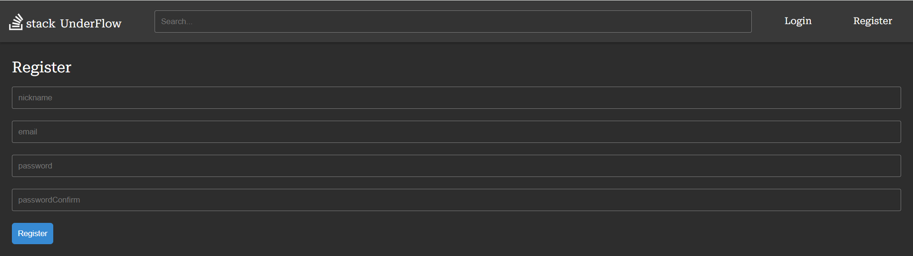
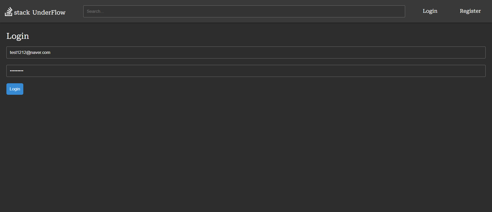

# 스택언더플로우

스택오버플로우의 주요 기능을 CloneCoding한 프로젝트로 React에 익숙해지기 위해 진행하였습니다.

프로젝트 참여인원: 1명

# 프로젝트 실행 전 사전 요구 사항
패키지 설치
> npm i

.env파일 설정
> VITE_API_URL = http://severAddress:80 // 서버 주소
# 로컬 환경에서 프로젝트 실행 방법
> npm run dev

# 프로젝트 기술 스택

# 프로젝트를 통해 얻은 것들
- React의 기본 Hooks들에 대해 자세히 알고 사용에 익숙해졌다.
- React파일들을 관리하기 쉬운 폴더 구조를 알게 되었다.
- 리액트의 다양한 라이브러리들(react-router, react-mark 등)을 사용하는데 익숙해졌다.
- axios를 통한 클라이언트-백엔드 통신에 익숙해졌다.
- styled-components라이브러리를 사용하면서 CSS-in-JS방식에 익숙해졌다.
- Context-API를 통해 전역적으로 상태 관리하는 방법을 알게되었다.
- PropTypes 라이브러리를 통해 컴퍼넌트가 필요로 하는 데이터 검증하는 법에 익숙해졌다.
 
 
 
# 프로젝트에서 구현된 기능들
- 회원가입 및 로그인
- 질문 게시하기
- 답변 달기
- 질문 또는 답변 추천하기
- 유저 프로필 보기

# 마주했던 문제점 및 해결 방법

  
1. 키보드 입력 시 렉이 걸리는 현상

알게된 것:
- 리액트 컴퍼넌트 내에서 상태변경에 따라 리렌더링이 되는 작동 방식에 대해 이해하게 됨.

해결 방법:  
- 기존 컴퍼넌트로부터 키보드 입력을 받는 부분을 새로운 컴퍼넌트로 분리
- 새로운 컴퍼넌트로 분리하는 것이 어려울 경우 React.memo를 이용한 리렌더링 방지

  
2. Prop Drilling 현상

알게된 것:
- 리액트에서는 전역적으로 상태관리를 하는 것을 도와주는 Context API가 존재함.
- Redux와 같은 상태 관리 라이브러리에 대해 알게 됨.

해결 방법:  
- 많은 자식들 간에 공유되는 상태의 경우 Context-API를 통해 관리하여 Prop Drilling 현상을 방지

  
3. src폴더에 구분 없이 모든 파일을 모아둬서 파일 구분이 힘들어짐

알게된 것:
- 가능한 각 파일들을 목적에 따라 구분해서 폴더에 적재하는 것이 유지보수와 가독성 측에서 도움이 됨.
- 좋은 폴더 구조를 가지는 것의 중요성을 알게됨.

해결 방법:  
- src폴더 내에 파일들을 구분할 수 있는 폴더를 만듦
- api폴더의 경우 서버와 통신하는 로직들이 담겨 있음
- components의 경우 리액트 컴퍼넌트들을 모아둠
- components내에도 containers폴더와 presentaions폴더가 존재
- containers폴더는 상태 관리를 하는 컴퍼넌트를 presentations은 표현 하는 컴퍼넌트를 모아둠.
- pages 폴더에는 각 페이지 컴퍼넌트를 모아둠.

  
4. N+1 Query로 인한 컴퍼넌트 리렌더링 렉

알게된 것:
- React에서 부모 컴퍼넌트에서 한 번에 데이터를 가져오지 않고 자식들을 통해 재귀적으로 데이터를 서버에 요청해서 처리하는 것은 리렌더링을 N+1만큼 발생시키고 렉을 유발할 수 있음. 
  N+1 Query문제가 프론트에서도 문제가 되는 것임.

해결 방법:  
- 부모가 데이터를 한 번에 가져와서 가져온 데이터를 자식들에게 props로 넘겨주는 방식을 통해 리렌더링을 최소화함.

# 프로젝트 페이지 화면
<table border="3">
  <tbody>
  <tr align="center">
    <td colspan=3><b>이미지를 클릭하면 크게 볼 수 있습니다!</b></td>
  </tr>
  <tr align="center">
    <td width="300">홈</td>
    <td width="300">게시판 상세보기</td>
    <td width="300">게시글 작성하기</td>
  </tr>
  <tr>
    <td></td>
    <td></td>
    <td></td>
  </tr>
  <tr align="center">
    <td>회원가입</td>
    <td>로그인</td>
    <td>프로필 페이지</td>
  </tr>
  <tr>
    <td></td>
    <td></td>
    <td></td>
  </tr>
</table>

# 프로젝트 회고
- 리액트를 사용하면서 가장 많이 부딪힌 문제는 상태 변경으로 인해 리렌더링되는 범위를 생각하지 않고 만들다가 너무 많은 범위를 리렌더링하게 되어 렉이 걸리는 문제였다. 해결하기는 쉬운 문제였지만 내가 리액트에 익숙하지 않고 잘 모른다는 것을 매번 느끼게 만들었다.

- 처음에는 src폴더 안에 모든 파일들을 구분없이 넣어뒀다. 조금씩 복잡해지자 파일을 찾는다고 시간을 쓰는 상황이 발생하였고 폴더 구조에 대해 고민하는 계기가 되었다. 결과적으로는 API 폴더, Components 폴더, Page 폴더, Context 폴더 등을 생성하여 파일을 관리하였고 파일을 찾는데 시간을 쓰는 문제는 잘 해결되었다. 이를 계기로 코드만 잘 정리하는 것이 아니라 폴더와 파일도 잘 정리해야 한다는 것을 몸소 느꼈다.

- 초반에는 머리로 감당할 수 있었기에 각 컴퍼넌트들에 대해 props를 검증하지 않았다. 결과적으로 서버의 API를 보면서 어떤 데이터가 들어있는지 계속 보게 되는 생산성 떨어지는 일을 하게 만들었다. 결국 모든 컴퍼넌트들에 대해 props들을 검증하게 되었다. 프로그램을 만드는데 있어서 내 기억력에 의존하는 것은 오만하고 생산력을 떨어뜨리는 일이라는 것을 몸소 느끼게 되었다.